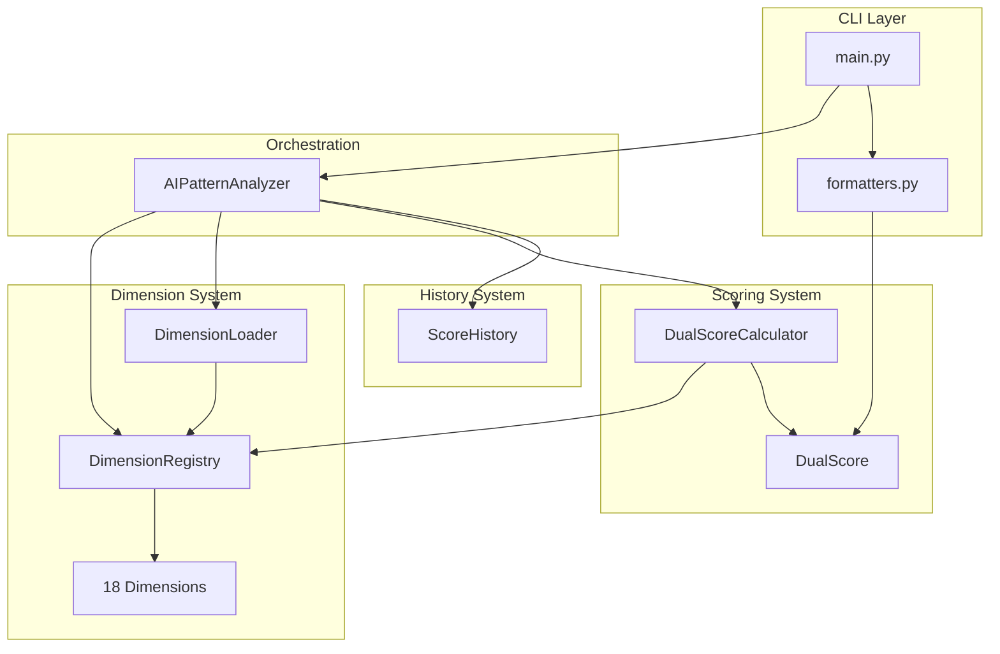

# WriteScore Architecture Document

**Version:** 1.2
**Status:** Active
**Last Updated:** 2025-12-06
**Product Version:** 6.3.0

---

## Change Log

| Change | Date | Version | Description | Author |
|--------|------|---------|-------------|--------|
| Epic 6 updates | 2025-12-06 | 1.2 | Added developer environment, CI/CD enhancements, security infrastructure from Epic 6 | SM Agent |
| Enhanced with codebase analysis | 2025-12-02 | 1.1 | Added data flow, exception hierarchy, detailed component interfaces | SM Agent |
| Initial Architecture | 2025-11-26 | 1.0 | Reverse-engineered architecture from codebase v6.3.0 | Architect Agent |

---

## 1. Introduction

### 1.1 Purpose

This document describes the software architecture of WriteScore, an AI writing pattern analysis and scoring tool. It serves as the authoritative reference for understanding the system's structure, components, and design decisions.

### 1.2 Scope

This architecture document covers:
- System overview and architectural patterns
- Technology stack and dependencies
- Component architecture and interactions
- Data models and persistence
- Source code organization
- Infrastructure and deployment
- Coding standards and testing

### 1.3 Existing Project Analysis

| Aspect | Current State |
|--------|---------------|
| **Primary Purpose** | AI writing pattern analysis and scoring tool |
| **Tech Stack** | Python 3.9+, Click CLI, NLTK, spaCy, transformers, torch |
| **Architecture Style** | Modular monolith with plugin-like dimension system |
| **Deployment** | Local CLI installation via pip |

### 1.4 Architectural Patterns Identified

| Pattern | Location | Purpose |
|---------|----------|---------|
| **Registry Pattern** | `core/dimension_registry.py` | Thread-safe dimension registration |
| **Strategy Pattern** | `dimensions/base_strategy.py` | Pluggable dimension analyzers |
| **Factory/Loader** | `core/dimension_loader.py` | Config-driven dimension instantiation |
| **Dataclass Models** | `core/results.py`, `scoring/dual_score.py` | Immutable result objects |
| **Facade** | `core/analyzer.py` | Unified analysis interface |

### 1.5 Constraints

- **No database** - All persistence is file-based (JSON)
- **Local execution only** - No API server or web interface
- **Memory-bound for ML** - Transformer models require significant RAM
- **Python-only** - No multi-language components

### 1.6 Future Considerations

- Potential web service/API evolution
- **MCP (Model Context Protocol) Server** - Enable WriteScore as a tool for AI assistants
- Service layer extraction for API/MCP reuse

---

## 2. Technology Stack

### 2.1 Core Technologies

| Category | Technology | Version | Purpose |
|----------|------------|---------|---------|
| **Language** | Python | 3.9+ | Core implementation |
| **CLI Framework** | Click | 8.0+ | Command-line interface |
| **Markdown Parsing** | marko | 2.0+ | AST-based Markdown analysis |
| **NLP - Tokenization** | NLTK | 3.8+ | Sentence/word tokenization |
| **NLP - Parsing** | spaCy | 3.7+ | Dependency parsing, POS tagging |
| **NLP - Readability** | textstat | 0.7.3+ | Readability metrics |
| **NLP - Advanced** | textacy | 0.13+ | Text statistics, MTLD |
| **ML - Transformers** | transformers | 4.35+ | GLTR, perplexity models |
| **ML - Backend** | torch | 2.0+ | PyTorch for model inference |
| **ML - Embeddings** | sentence-transformers | 2.0+ | Semantic coherence |
| **Math/Stats** | numpy, scipy | 1.24+, 1.11+ | Numerical operations |
| **Testing** | pytest | 7.4+ | Test framework |
| **Linting** | ruff | 0.1+ | Code quality |

### 2.2 Dependency Groups

**Core Dependencies:**
```
marko>=2.0.0
nltk>=3.8
spacy>=3.7.0
textstat>=0.7.3
transformers>=4.35.0
torch>=2.0.0
scikit-learn>=1.3.0
scipy>=1.11.0
textacy>=0.13.0
numpy>=1.24.0
click>=8.0.0
sentence-transformers>=2.0.0
```

**Development Dependencies:** `[dev]`
```
pytest>=7.4.0
pytest-cov>=4.1.0
pytest-timeout>=2.2.0
psutil>=5.9.0
ruff>=0.1.0
```

**ML Extras:** `[ml]`
```
accelerate>=0.20.0
datasets>=2.14.0
```

### 2.3 Architectural Recommendations

| Observation | Recommendation | Priority |
|-------------|----------------|----------|
| Heavy ML deps always loaded | Lazy imports for CLI startup speed | Medium |
| No async support | Add async for future API/MCP server | High |
| No caching layer | Add optional result caching | Medium |

---

## 3. Component Architecture

### 3.1 High-Level Architecture

```
┌─────────────────────────────────────────────────────────────────┐
│                         CLI Layer                               │
│                    (cli/main.py, formatters.py)                 │
├─────────────────────────────────────────────────────────────────┤
│                      Orchestration Layer                        │
│                    (core/analyzer.py)                           │
├──────────────────┬──────────────────┬───────────────────────────┤
│   Dimension      │    Scoring       │      History              │
│   System         │    System        │      System               │
│  (dimensions/)   │   (scoring/)     │    (history/)             │
├──────────────────┴──────────────────┴───────────────────────────┤
│                     Core Infrastructure                         │
│        (registry, loader, config, results, exceptions)          │
└─────────────────────────────────────────────────────────────────┘
```

### 3.2 Component Descriptions

#### CLI Layer (`cli/`)

| Component | File | Responsibility |
|-----------|------|----------------|
| **CLI Entry Point** | `main.py` | Click commands, argument parsing |
| **Formatters** | `formatters.py` | Output formatting (text, JSON, TSV) |

#### Orchestration Layer (`core/analyzer.py`)

**AIPatternAnalyzer** - Facade orchestrating all analysis:

```python
class AIPatternAnalyzer:
    def analyze_file(file_path, config) -> AnalysisResults
    def analyze_text(text, config) -> AnalysisResults
    def analyze_file_detailed(file_path) -> DetailedAnalysis
    def calculate_dual_score(results, targets) -> DualScore
    def load_score_history(file_path) -> ScoreHistory
    def save_score_history(history) -> None
```

#### Dimension System (`dimensions/`)

| Component | Purpose |
|-----------|---------|
| **DimensionStrategy** | Abstract base class for all dimensions |
| **DimensionRegistry** | Thread-safe dimension registration |
| **DimensionLoader** | Config-driven lazy loading |
| **18 Dimensions** | Individual analysis implementations |

**DimensionStrategy Interface:**
```python
class DimensionStrategy(ABC):
    @property
    def dimension_name(self) -> str
    @property
    def weight(self) -> float
    @property
    def tier(self) -> DimensionTier  # ADVANCED, CORE, SUPPORTING, STRUCTURAL

    def analyze(text, lines, **kwargs) -> Dict[str, Any]
    def calculate_score(metrics) -> float  # 0-100, 100=most human-like
    def get_recommendations(score, metrics) -> List[str]
```

#### Scoring System (`scoring/`)

| Component | Purpose |
|-----------|---------|
| **DualScore** | Score dataclasses, categories |
| **DualScoreCalculator** | Registry-based score calculation |
| **ScoreNormalization** | Z-score normalization |

#### History System (`history/`)

| Component | Purpose |
|-----------|---------|
| **ScoreHistory** | Score tracking dataclass |
| **Trends** | Trend visualization, comparisons |

### 3.3 Component Interaction Diagram



### 3.4 Dimension Inventory

| Dimension | Tier | Weight | Purpose |
|-----------|------|--------|---------|
| `perplexity` | CORE | 12.0% | AI vocabulary detection |
| `burstiness` | CORE | 5.5% | Sentence variation (GPTZero methodology) |
| `formatting` | CORE | 8.0% | Em-dash patterns (strongest AI signal) |
| `voice` | CORE | 6.0% | First-person, contractions, authenticity |
| `ai_vocabulary` | CORE | 5.0% | AI-typical word patterns |
| `transition_marker` | CORE | 4.0% | Formulaic transitions |
| `predictability` | ADVANCED | 15.0% | GLTR/n-gram analysis (transformers) |
| `semantic_coherence` | ADVANCED | 10.0% | Cross-sentence coherence (embeddings) |
| `syntactic` | SUPPORTING | 5.0% | Dependency tree complexity |
| `lexical` | SUPPORTING | 4.0% | Type-token ratio diversity |
| `advanced_lexical` | SUPPORTING | 6.0% | MATTR, HDD, Yule's K |
| `figurative_language` | SUPPORTING | 5.0% | Similes, metaphors, idioms |
| `sentiment` | SUPPORTING | 4.0% | Emotional variance detection |
| `readability` | SUPPORTING | 3.0% | Flesch-Kincaid, Gunning Fog |
| `pragmatic_markers` | SUPPORTING | 3.5% | Discourse markers |
| `structure` | STRUCTURAL | 4.0% | Heading hierarchy, lists |

### 3.5 Dimension Self-Registration Pattern

Each dimension follows this implementation pattern:

```python
class MyDimension(DimensionStrategy):
    def __init__(self):
        super().__init__()
        DimensionRegistry.register(self)  # Self-registration

    @property
    def dimension_name(self) -> str:
        return "my_dimension"

    @property
    def weight(self) -> float:
        return 5.0  # Percentage of total score

    @property
    def tier(self) -> str:
        return "CORE"  # ADVANCED, CORE, SUPPORTING, or STRUCTURAL

    def analyze(self, text, lines=None, config=None, **kwargs):
        # Use base class helper for mode-aware text preparation
        prepared = self._prepare_text(text, config, self.dimension_name)
        # Analyze and return metrics dict
        return {'metric': value, 'available': True, ...}

    def calculate_score(self, metrics):
        # Return 0-100 where 100 = most human-like
        score = ...
        self._validate_score(score)
        return score

    def get_recommendations(self, score, metrics):
        if score < 75:
            return ["Specific actionable suggestion"]
        return []

# Module-level singleton triggers self-registration on import
_instance = MyDimension()
```

---

## 4. Data Flow

### 4.1 Analysis Pipeline

```
┌─────────────┐     ┌─────────────────┐     ┌──────────────────┐
│  Input File │────▶│  Text Extraction │────▶│  Preprocessing   │
│   (.md)     │     │  (marko parser)  │     │  (HTML comments) │
└─────────────┘     └─────────────────┘     └──────────────────┘
                                                      │
                                                      ▼
                    ┌─────────────────────────────────────────────────┐
                    │              DimensionLoader                     │
                    │  Load dimensions based on profile               │
                    │  (fast: 4, balanced: 8, full: 16)               │
                    └─────────────────────────────────────────────────┘
                                                      │
                                                      ▼
     ┌──────────────────────────────────────────────────────────────────┐
     │                     Dimension Analysis Loop                       │
     │  For each loaded dimension:                                       │
     │  1. Prepare text based on mode (FAST/ADAPTIVE/SAMPLING/FULL)     │
     │  2. Call dimension.analyze(prepared_text, config)                │
     │  3. Store metrics in dimension_results dict                       │
     └──────────────────────────────────────────────────────────────────┘
                                                      │
                                                      ▼
     ┌──────────────────────────────────────────────────────────────────┐
     │                      Score Calculation                            │
     │  For each dimension:                                              │
     │  1. Call dimension.calculate_score(metrics)                       │
     │  2. Apply z-score normalization (if enabled)                      │
     │  3. Weight by dimension.weight                                    │
     │  4. Aggregate into tier categories                                │
     │  5. Sum for Quality Score, invert for Detection Risk              │
     └──────────────────────────────────────────────────────────────────┘
                                                      │
                                                      ▼
     ┌──────────────────────────────────────────────────────────────────┐
     │                    Report Generation                              │
     │  • Format results based on --format option                        │
     │  • Generate recommendations if --show-scores                      │
     │  • Save to history if enabled                                     │
     │  • Output to stdout or --output file                              │
     └──────────────────────────────────────────────────────────────────┘
```

### 4.2 Scoring Flow Detail

```
┌────────────────────────────────────────────────────────────────────────┐
│                    DualScoreCalculator Flow                             │
├────────────────────────────────────────────────────────────────────────┤
│                                                                         │
│  1. DISCOVER: DimensionRegistry.get_all()                              │
│       │                                                                 │
│       ▼                                                                 │
│  2. VALIDATE: WeightMediator.is_valid()                                │
│       │         (ensure weights sum to 100.0)                          │
│       ▼                                                                 │
│  3. SCORE: For each dimension                                          │
│       │     • Extract metrics from results.dimension_results           │
│       │     • Call dimension.calculate_score(metrics)                  │
│       │     • Apply z-score normalization                              │
│       │     • Weight: normalized_score = (score/100) * weight          │
│       ▼                                                                 │
│  4. CATEGORIZE: Group by tier                                          │
│       │     • ADVANCED: 30-40% of total                                │
│       │     • CORE: 35-45% of total                                    │
│       │     • SUPPORTING: 15-25% of total                              │
│       │     • STRUCTURAL: 5-10% of total                               │
│       ▼                                                                 │
│  5. AGGREGATE:                                                         │
│       │     • quality_score = sum(all tier totals)                     │
│       │     • detection_risk = 100 - quality_score                     │
│       ▼                                                                 │
│  6. RECOMMEND: Generate improvement actions                            │
│       │     • Sort by impact (HIGH > MEDIUM > LOW)                     │
│       │     • Build ROI-optimized path to target                       │
│       ▼                                                                 │
│  7. RETURN: DualScore dataclass                                        │
│                                                                         │
└────────────────────────────────────────────────────────────────────────┘
```

---

## 5. Exception Hierarchy

```
AIPatternAnalyzerError (base)
├── DimensionNotFoundError
│   └── Raised when dimension not in registry
│       Attributes: dimension_name
│
├── DuplicateDimensionError
│   └── Raised on duplicate registration attempt
│       Attributes: dimension_name
│
├── InvalidTierError
│   └── Raised when tier is not valid
│       Attributes: tier, valid_tiers
│
├── InvalidWeightError
│   └── Raised when weight outside 0-100
│       Attributes: weight, valid_range
│
└── ParameterLoadError
    └── Raised when parameter config cannot load
        Attributes: config_path

AnalysisError (base)
├── EmptyFileError
│   └── Raised when file has no analyzable content
│
└── InsufficientDataError
    └── Raised when not enough data for analysis
```

---

## 6. Data Models

### 6.1 Core Data Models

#### AnalysisResults

Primary output from `AIPatternAnalyzer.analyze_file()`:

```python
@dataclass
class AnalysisResults:
    file_path: str
    total_words: int
    total_sentences: int
    total_paragraphs: int
    dimension_results: Dict[str, DimensionResult]
    metadata: Dict[str, Any]
```

#### DualScore

Output from `calculate_dual_score()`:

```python
@dataclass
class DualScore:
    detection_risk: float      # 0-100 (lower = better)
    quality_score: float       # 0-100 (higher = better)
    detection_interpretation: str
    quality_interpretation: str
    categories: List[ScoreCategory]
    improvements: List[ImprovementAction]
    path_to_target: List[ImprovementAction]
    estimated_effort: str
```

#### Supporting Models

```python
@dataclass
class ScoreDimension:
    name: str
    score: float
    max_score: float
    percentage: float
    impact: str  # 'NONE', 'LOW', 'MEDIUM', 'HIGH'

@dataclass
class ImprovementAction:
    priority: int
    dimension: str
    potential_gain: float
    action: str
    effort_level: str  # 'LOW', 'MEDIUM', 'HIGH'
```

### 6.2 Persistence Model

**No database** - File-based JSON persistence:

| Data Type | Location | Format |
|-----------|----------|--------|
| Score History | `.ai-analysis-history/{file}.history.json` | JSON |
| Parameters | `config/scoring_parameters.yaml` | YAML |
| Parameter Archive | `config/parameters/archive/` | YAML |

---

## 7. Source Code Organization

### 7.1 Project Structure

```
writescore/
├── .devcontainer/           # VS Code/Codespaces devcontainer
│   └── devcontainer.json
├── .github/                 # GitHub configuration
│   ├── workflows/           # CI/CD workflows
│   │   ├── ci.yml           # Main CI pipeline
│   │   ├── codeql.yml       # CodeQL security scanning
│   │   └── release.yml      # Release automation
│   ├── dependabot.yml       # Dependency updates
│   ├── ISSUE_TEMPLATE/      # Issue templates
│   │   ├── bug_report.yml
│   │   ├── feature_request.yml
│   │   └── config.yml
│   └── PULL_REQUEST_TEMPLATE.md
├── docs/                    # Documentation
│   └── stories/             # Epic and story definitions
├── src/writescore/          # Main package
│   ├── cli/                 # Command Line Interface
│   ├── core/                # Core Analysis Engine
│   ├── dimensions/          # Dimension Analyzers (18)
│   ├── scoring/             # Scoring System
│   ├── history/             # Score History Tracking
│   ├── evidence/            # Evidence Extraction
│   ├── utils/               # Utilities
│   └── data/                # Static Data Files
├── tests/                   # Test Suite
│   ├── unit/                # Unit tests
│   ├── integration/         # Integration tests
│   ├── accuracy/            # Accuracy validation
│   ├── performance/         # Performance benchmarks
│   └── fixtures/            # Sample documents
├── Justfile                 # Task runner commands
├── pyproject.toml           # Package configuration
├── CODE_OF_CONDUCT.md       # Contributor Covenant
├── CONTRIBUTING.md          # Contribution guidelines
├── SECURITY.md              # Security policy
└── README.md                # Project overview
```

### 7.2 Naming Conventions

| Category | Convention | Example |
|----------|------------|---------|
| Modules | `snake_case.py` | `dual_score_calculator.py` |
| Classes | `PascalCase` | `AIPatternAnalyzer` |
| Functions | `snake_case` | `calculate_dual_score()` |
| Constants | `UPPER_SNAKE_CASE` | `AI_VOCAB_REPLACEMENTS` |
| Tests | `test_*.py` | `test_perplexity.py` |

### 7.3 Future Structure for MCP/API

```
src/writescore/
├── ...existing...
├── services/                # NEW: Business Logic Layer
│   ├── analysis_service.py
│   └── history_service.py
└── mcp/                     # NEW: MCP Server
    ├── server.py
    ├── tools.py
    └── resources.py
```

---

## 8. Infrastructure & Deployment

### 8.1 Deployment Model

| Aspect | Current State |
|--------|---------------|
| **Deployment Type** | Local pip installation |
| **Server Infrastructure** | None |
| **Database** | None (file-based JSON) |
| **Container Support** | VS Code Devcontainer, GitHub Codespaces |

### 8.2 CI/CD Pipeline

#### CI Workflow (`.github/workflows/ci.yml`)

| Job | Trigger | Steps |
|-----|---------|-------|
| **pre-commit** | Push/PR to main | Run all pre-commit hooks |
| **dependency-review** | PR only | Check for vulnerable dependencies |
| **lint** | Push/PR to main | ruff check |
| **test** | Push/PR to main | pytest (Python 3.9, 3.10, 3.11, 3.12) |

**Caching:**
- pip packages cached with `pyproject.toml` hash key
- spaCy model cached with version-specific key

#### CodeQL Workflow (`.github/workflows/codeql.yml`)

| Trigger | Steps |
|---------|-------|
| Push/PR to main, Weekly schedule | Python security analysis |

#### Release Workflow (`.github/workflows/release.yml`)

| Trigger | Steps |
|---------|-------|
| Tag `v*` | Build → GitHub Release |

#### Dependabot (`.github/dependabot.yml`)

| Ecosystem | Schedule | Notes |
|-----------|----------|-------|
| pip | Weekly (Monday) | Dev deps grouped, ML deps grouped |
| github-actions | Monthly | Workflow action updates |

### 8.3 Environment Requirements

| Component | Requirement |
|-----------|-------------|
| Python | 3.9, 3.10, 3.11, or 3.12 |
| spaCy model | `en_core_web_sm` (manual download) |
| NLTK data | `punkt`, `punkt_tab` (auto-download) |

### 8.4 Installation

#### Using Just (Recommended)

```bash
# Install Just (macOS)
brew install just

# User install
just install

# Developer install
just dev
```

#### Manual Installation

```bash
# Development install
pip install -e ".[dev]"
python -m spacy download en_core_web_sm
pre-commit install
pre-commit install --hook-type commit-msg

# CLI usage
writescore analyze document.md
```

#### Available Just Commands

| Command | Description |
|---------|-------------|
| `just` | List available commands |
| `just install` | Install package + spacy model |
| `just dev` | Full dev setup with pre-commit hooks |
| `just test` | Run unit and integration tests |
| `just test-fast` | Run tests excluding slow markers |
| `just lint` | Check code with ruff |
| `just format` | Format code with ruff |
| `just coverage` | Generate HTML coverage report |
| `just clean` | Remove build artifacts |

### 8.5 Developer Environment Options

| Option | Local Install | Docker Required | Best For |
|--------|:-------------:|:---------------:|----------|
| **Native (Just)** | Yes | No | Most developers |
| **Native (Manual)** | Yes | No | Users without Just |
| **Devcontainer** | No | Yes | Consistent environment |
| **GitHub Codespaces** | No | No | Cloud development |

#### Devcontainer

The `.devcontainer/devcontainer.json` provides:
- Python 3.12 base image
- Just pre-installed
- VS Code extensions (Python, Ruff, mypy)
- Auto-runs `just dev` on container creation

```bash
# VS Code: "Reopen in Container"
# CLI:
devcontainer up --workspace-folder .
devcontainer exec --workspace-folder . just test
```

#### GitHub Codespaces

```bash
gh codespace create -r BOHICA-LABS/writescore
gh codespace ssh
# Then: just dev
```

### 8.6 Security Infrastructure

#### Security Scanning

| Tool | Type | Trigger |
|------|------|---------|
| **CodeQL** | Static analysis (SAST) | Push, PR, weekly schedule |
| **Dependency Review** | Vulnerable deps in PRs | Pull requests only |
| **Secret Scanning** | Leaked credentials | Always (GitHub default) |
| **Push Protection** | Block secrets in commits | Always (GitHub default) |
| **ggshield** | Pre-commit secret scan | Local commits |

#### Dependency Management

| Feature | Configuration |
|---------|---------------|
| **Dependabot Alerts** | Enabled in repo settings |
| **Dependabot Security Updates** | Auto-PRs for vulnerable deps |
| **Dependabot Version Updates** | Weekly pip, monthly Actions |

#### Security Policy

`SECURITY.md` defines:
- Supported versions
- Vulnerability reporting via GitHub Private Reporting
- Response timeline (48h initial, 7d update, 30d resolution)
- Scope and out-of-scope items

---

## 9. Coding Standards

### 9.1 Code Style

**Enforced via ruff:**
- Line length: 100 characters
- Target: Python 3.9
- Rules: E, F, W, I, UP, B, C4, SIM

### 9.2 Documentation

**Google-style docstrings:**
```python
def calculate_score(metrics: Dict[str, Any]) -> float:
    """
    Calculate dimension score from raw metrics.

    Args:
        metrics: Dictionary containing raw analysis metrics

    Returns:
        Score from 0-100 where 100 = most human-like
    """
```

### 9.3 Type Hints

Required for all public function signatures:
```python
def analyze(
    text: str,
    lines: List[str],
    config: Optional[AnalysisConfig] = None
) -> Dict[str, Any]:
```

---

## 10. Testing Strategy

### 10.1 Test Organization

| Directory | Purpose | Marker |
|-----------|---------|--------|
| `tests/unit/` | Isolated unit tests | (default) |
| `tests/integration/` | Cross-module tests | `@pytest.mark.integration` |
| `tests/accuracy/` | Detection accuracy | `@pytest.mark.accuracy` |
| `tests/performance/` | Benchmarks | `@pytest.mark.slow` |

### 10.2 Test Patterns

**Dimension Testing:**
```python
def test_burstiness_high_variance_returns_high_score():
    """High variance (human-like) should score well."""
    dim = BurstinessDimension()
    score = dim.calculate_score({'variance': 25.0})
    assert score >= 80.0
```

**Registry Auto-Clear:**
```python
@pytest.fixture(autouse=True)
def clear_dimension_registry():
    DimensionRegistry.clear()
    yield
    DimensionRegistry.clear()
```

### 10.3 Coverage Targets

| Metric | Target |
|--------|--------|
| Line Coverage | 80%+ |
| Branch Coverage | Enabled |

---

## 11. Risk Assessment

| Risk Type | Risk | Mitigation |
|-----------|------|------------|
| **Technical** | Transformer models (GLTR) are slow on large documents | ADAPTIVE/SAMPLING modes limit analysis scope |
| **Technical** | spaCy/NLTK require model downloads on first run | Lazy loading with fallback handling |
| **Technical** | Memory usage with large documents + ML models | Sampling modes reduce memory footprint |
| **Dependency** | transformers/torch versions can conflict | Pinned minimum versions in pyproject.toml |
| **Compatibility** | Python 3.9 approaching EOL (Oct 2025) | Already supports 3.10-3.12 |

---

## 12. Architectural Recommendations

### 12.1 For MCP Server Evolution

| Gap | Recommendation | Priority |
|-----|----------------|----------|
| No async support | Add async wrappers for analysis | High |
| No service layer | Extract business logic from CLI | High |
| No caching | Add result caching for repeated queries | Medium |
| Tight CLI coupling | Decouple for API/MCP reuse | High |

### 12.2 Proposed MCP Architecture

```
┌─────────────────────────────────────────────────┐
│              MCP Client (Claude)                │
└─────────────────────┬───────────────────────────┘
                      │ JSON-RPC over stdio/HTTP
┌─────────────────────▼───────────────────────────┐
│              MCP Server Layer                   │
│  ┌─────────────┐  ┌──────────────┐              │
│  │   Tools     │  │  Resources   │              │
│  │ - analyze   │  │ - config     │              │
│  │ - score     │  │ - dimensions │              │
│  └─────────────┘  └──────────────┘              │
├─────────────────────────────────────────────────┤
│              Service Layer (NEW)                │
├─────────────────────────────────────────────────┤
│              Existing Core                      │
│    AIPatternAnalyzer, Dimensions, Scoring       │
└─────────────────────────────────────────────────┘
```

---

## 13. Appendix

### A. Quick Reference

**Installation:**
```bash
pip install -e ".[dev]"
python -m spacy download en_core_web_sm
```

**CLI Commands:**
```bash
writescore analyze document.md
writescore analyze document.md --detailed
writescore analyze document.md --show-scores
writescore analyze --batch directory/
writescore recalibrate dataset.jsonl
```

**Scoring Convention:**
- 0-100 scale where **100 = most human-like**
- Detection Risk: Lower is better (target: <30)
- Quality Score: Higher is better (target: >85)

### B. Tier Weights

| Tier | Weight Range | Examples |
|------|--------------|----------|
| ADVANCED | 30-40% | predictability, semantic_coherence |
| CORE | 35-45% | burstiness, formatting, voice |
| SUPPORTING | 15-25% | lexical, sentiment, readability |
| STRUCTURAL | 5-10% | structure |

### C. Related Documents

- [Product Requirements Document](prd.md)
- [CLAUDE.md](../CLAUDE.md) - AI assistant instructions
- [CHANGELOG.md](../CHANGELOG.md) - Version history

---

*This architecture document was reverse-engineered from the WriteScore v6.3.0 codebase to establish a baseline architectural reference.*

---

## 14. Package Structure (Detailed)

This section provides a comprehensive view of the package structure with module descriptions.

```
writescore/
├── __init__.py                 # Main package exports for backward compatibility
├── core/                       # Core analysis engine
│   ├── analyzer.py            # Main AIPatternAnalyzer class
│   └── results.py             # Result dataclasses
├── dimensions/                # Analysis dimensions (12 total in v5.0.0)
│   ├── base_strategy.py      # Base DimensionStrategy interface
│   ├── perplexity.py         # AI vocabulary & perplexity
│   ├── burstiness.py         # Sentence/paragraph variation
│   ├── structure.py          # Section/heading analysis
│   ├── formatting.py         # Em-dash, bold/italic, etc.
│   ├── voice.py              # Voice consistency
│   ├── syntactic.py          # Syntactic complexity
│   ├── lexical.py            # Lexical diversity
│   ├── sentiment.py          # Sentiment analysis
│   ├── readability.py        # Readability metrics
│   ├── transition_marker.py  # AI transition markers
│   ├── predictability.py     # GLTR/n-gram analysis
│   └── advanced_lexical.py   # Advanced lexical metrics
├── scoring/                   # Scoring system
│   ├── dual_score.py         # Dual scoring dataclasses + thresholds
│   └── dual_score_calculator.py  # Dual score calculation
├── history/                   # History tracking
│   ├── tracker.py            # History tracking dataclasses
│   └── export.py             # CSV/JSON export (future enhancement)
├── evidence/                  # Evidence extraction (future expansion)
│   └── __init__.py           # Placeholder
├── utils/                     # Shared utilities
│   ├── text_processing.py    # Text cleaning, word counting
│   ├── pattern_matching.py   # Regex patterns, constants
│   └── visualization.py      # Sparklines, charts
└── cli/                       # CLI interface
    ├── main.py               # Click-based CLI entry point
    ├── args.py               # Legacy argument parsing (backup)
    └── formatters.py         # Output formatting
```

---

## 15. Design Principles

### 15.1 Backward Compatibility

The package maintains backward compatibility through package-level exports:

```python
# Old way (still works)
from analyze_ai_patterns import AIPatternAnalyzer

# New way (recommended)
from writescore.core.analyzer import AIPatternAnalyzer

# Or use package import
from writescore import AIPatternAnalyzer
```

### 15.2 Dimension Analyzer Interface

All dimension analyzers implement the `DimensionAnalyzer` base class:

```python
class DimensionAnalyzer(ABC):
    @abstractmethod
    def analyze(self, text: str, lines: List[str], **kwargs) -> Dict[str, Any]:
        """Analyze text for this dimension"""
        pass

    @abstractmethod
    def score(self, analysis_results: Dict[str, Any]) -> tuple:
        """Calculate score for this dimension"""
        pass
```

### 15.3 Separation of Concerns

- **Core**: Orchestration and coordination
- **Dimensions**: Individual analysis algorithms
- **Scoring**: Dual-score calculation and interpretation
- **History**: Score tracking over time
- **Utils**: Shared helper functions
- **CLI**: User interface layer
